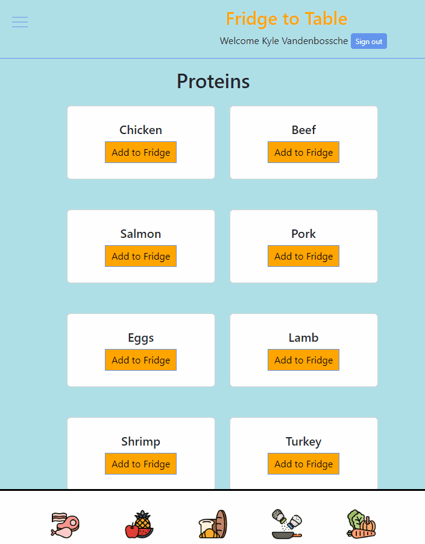

# Fridge to Table 
Fridge to table is an App that you add the contents of your actual fridge into your digital fridge, you can then monitor and update your fridge contents based on your usage. There is also a recipe function that calls an API from Edamam that returns recipes based on the ingredients that you want to cook with for that meal.
 
 ## Getting Started
 - Click the link here: https://recipes-31990.web.app/, to check it out! 
 - Full Documentation Here
 
 ## Features
- Expressive and intuitive UI
- Integrated JS functions 
- Build with React
- Digital fridge that updates and removes items from your fridge
- Interactive Recipe API calls

## Functionality 
- Add items from your fridge, into your digital fridge and search for recipes!

